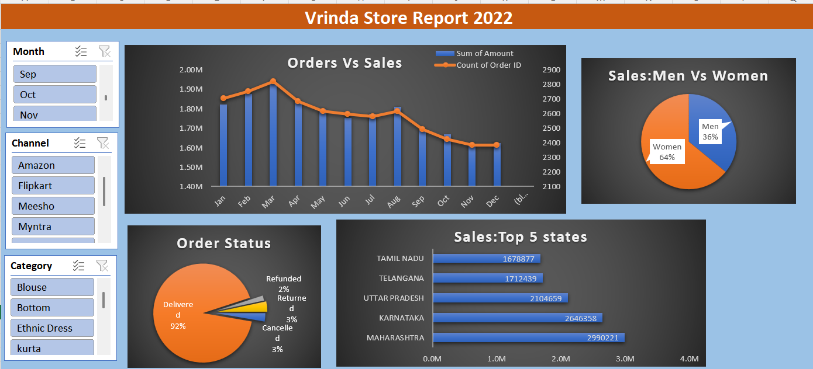
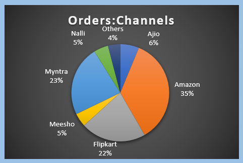
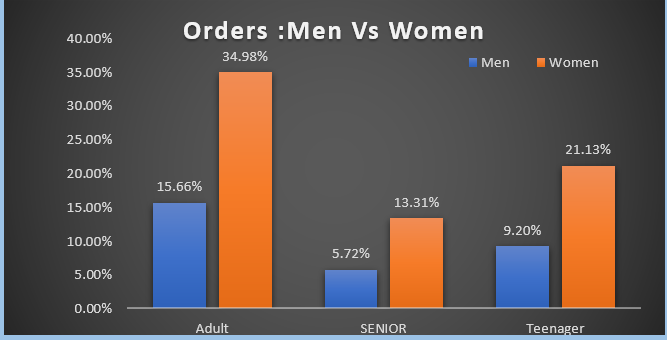

# Vrinda Store — Sales Analysis Dashboard (Excel)

An interactive Excel dashboard analyzing 2022 sales data for Vrinda Store, an e-commerce apparel seller operating across multiple online marketplaces (Amazon, Flipkart, Myntra, Ajio, Meesho, Nalli, etc.).

## Dashboard

## Tools Used
- **Microsoft Excel** — data cleaning, PivotTables, PivotCharts, and dashboard design
- **Slicers** for interactive filtering by Month, Channel, and Category

## Dataset
Raw order-level data (~31,000 rows) with fields including Order ID, Customer ID, Gender, Age, Date, Status, Channel, SKU, Category, Size, Qty, Amount, and shipping details (city/state/postal code).

## Data Cleaning
- Removed duplicate Order IDs and irrelevant/blank rows
- Converted the Date column to a proper date format for time-based analysis
- Standardized inconsistent text entries (category names, state names)
- Dropped constant/redundant columns (e.g. currency, since all transactions were in INR)
- Created derived fields — **Age Group** (Teenager/Adult/Senior) and **Month** — for grouped analysis
- Verified Amount values for cancelled/returned orders to avoid skewing revenue totals

## Key Insights

**Sales Trend**
- Sales peaked in March 2022 (~1.95M) and gradually declined toward the year-end, with order volume following a similar downward trend after mid-year.

**Order Status**
- 92% of orders were successfully delivered; only ~8% were cancelled, returned, or refunded — indicating healthy fulfillment performance.

**Top Selling States**
- Maharashtra, Karnataka, Uttar Pradesh, Telangana, and Tamil Nadu are the top 5 revenue-generating states, led by Maharashtra (~2.99M).

**Sales Channels**

- Amazon (35%) and Myntra (23%) together drive over half of total orders, followed by Flipkart (22%). Meesho, Nalli, and other channels contribute the remaining share.

**Customer Demographics**

- Women account for 64% of total sales vs. 36% for men.
- Across all age groups, women outspend men — Adult women lead all segments at ~35% of orders, followed by Teenager women (~21%).

## File
`Vrinda_Store_Data_Analysis-project1.xlsx` — contains the cleaned raw dataset, PivotTables, and the interactive dashboard.
